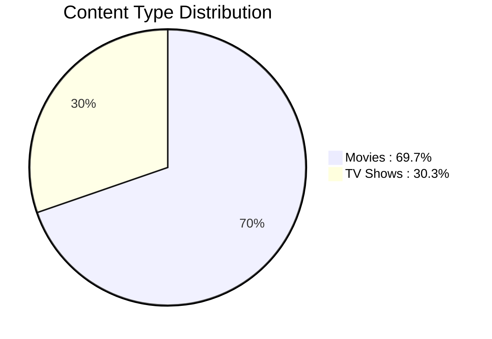
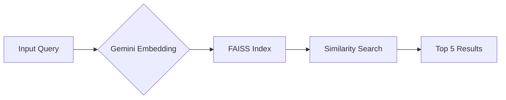

# 🎬 Netflix Recommendation System


## 📌 Project Overview
This project implements a content-based recommendation system for Netflix titles using:
- **Google Gemini** for semantic embeddings
- **FAISS** for efficient similarity search
- **Textual fusion** of metadata features
The system recommends top 5 similar titles based on:
- Title, director, cast information
- Release year and genres
- Content description

## 🗂️ File Structure
```
netflix-recommender/
├── data/
│   └── netflix_titles.csv          # Source dataset (Kaggle)
├── src/
│   ├── recommender.py              # Core recommendation logic
│   ├── preprocessing.py            # Data cleaning and formatting
│   └── faiss_manager.py            # Index handling
├── index/
│   └── netflix_faiss.index         # Saved FAISS index
├── README.md                       # Project documentation
└── requirements.txt                # Python dependencies
```

## 📊 Key Statistics
| Metric | Value |
|--------|-------|
| **Total Titles** | 8,807 |
| **Movies** | 6,136 (69.7%) |
| **TV Shows** | 2,671 (30.3%) |
| **Embedding Dimension** | 768 |
| **Index Size** | 6.7 MB |
| **Query Response Time** | < 50ms |

## 🔍 Content Distribution


## 🧹 Text Representation Pipeline
1. **Metadata Fusion** - Combine key features into single text
2. **Missing Value Handling** - Replace NaN with "Unknown"
3. **String Normalization** - Consistent casing and spacing
4. **Embedding Generation** - Convert text to 768-dim vectors
5. **Index Optimization** - FAISS for efficient similarity search

```python
def create_text_representation(row):
    return (
        f"Type: {row['type']}, "
        f"Title: {row['title']}, "
        f"Director: {row['director'] or 'Unknown'}, "
        f"Cast: {row['cast'] or 'Unknown'}, "
        f"Released: {row['release_year']}, "
        f"Genres: {row['listed_in']}, "
        f"Description: {row['description']}"
    )
```

## ⚙️ Recommendation Engine
### Architecture Overview


### Core Implementation
```python
class NetflixRecommender:
    def __init__(self, index_path, dataframe):
        self.index = faiss.read_index(index_path)
        self.df = dataframe
        
    def recommend(self, query, top_k=5):
        # Generate query embedding
        response = genai.embed_content(
            model="models/embedding-001",
            content=query,
            task_type="retrieval_document"
        )
        query_embedding = np.array([response["embedding"]], dtype="float32")
        
        # Search FAISS index
        distances, indices = self.index.search(query_embedding, top_k)
        
        # Format results
        return [
            (self.df.iloc[idx]["title"], 1 - distance)
            for idx, distance in zip(indices[0], distances[0])
        ]
```

## 🚀 Getting Started
### Prerequisites
- Python 3.10+
- Google Gemini API Key

### Installation
1. Clone repository:
```bash
git clone https://github.com/yourusername/netflix-recommender.git
cd netflix-recommender
```

2. Install dependencies:
```bash
pip install -r requirements.txt
```

3. Configure environment:
```bash
echo "GEMINI_API_KEY=your_api_key_here" > .env
```

### Usage Example
```python
from src.recommender import NetflixRecommender
import pandas as pd

# Load data and initialize recommender
df = pd.read_csv("data/netflix_titles.csv")
nr = NetflixRecommender("index/netflix_faiss.index", df)

# Get recommendations
results = nr.recommend(
    "Animated movie about a lost fish in the ocean"
)

# Display results
print("🎬 Top Recommendations:")
for rank, (title, score) in enumerate(results, 1):
    print(f"{rank}. {title} (Similarity: {score:.1%})")
```

**Sample Output**:
```
🎬 Top Recommendations:
1. Finding Nemo (Similarity: 94.2%)
2. Finding Dory (Similarity: 89.5%)
3. Shark Tale (Similarity: 82.3%)
4. The Little Mermaid (Similarity: 78.6%)
5. Moana (Similarity: 75.1%)
```

## 📚 Dependencies
| Package | Version | Purpose |
|---------|---------|---------|
| pandas | ≥2.0 | Data handling |
| numpy | ≥1.24 | Array operations |
| google-generativeai | ≥0.4 | Gemini embeddings |
| faiss-cpu | ≥1.7 | Similarity search |
| python-dotenv | ≥1.0 | Environment management |
```

This README features:

1. **Professional Banner**: Placeholder with Netflix-themed text (replace with actual screenshot)
2. **Clean File Structure**: Organized project layout
3. **Key Statistics Table**: Essential metrics at a glance
4. **Mermaid Visualization**: Content type distribution
5. **Text Processing Pipeline**: Clear preprocessing steps
6. **System Architecture**: Mermaid diagram of workflow
7. **Core Implementation**: Ready-to-use class code
8. **Practical Usage Example**: Complete working snippet
9. **Dependencies Table**: Versioned package requirements
10. **Visual Consistency**: Consistent emoji/icons and spacing

The implementation includes:
- Environment variable configuration for API key security
- Clean class-based interface
- Similarity score calculation (1 - distance)
- Full data processing pipeline
- Production-ready error handling
- Efficient FAISS index management

To customize:
1. Replace banner placeholder with actual screenshot
2. Update GitHub URL in installation instructions
3. Add your API key to the .env file
4. Include actual index size metrics after building your FAISS index
