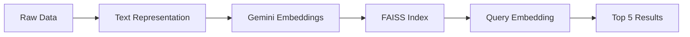

Here's a polished, professional README for your Netflix Recommendation System with improved organization and visual elements:

```markdown
# � Netflix Recommendation System
### Intelligent Content-Based Recommendations using Gemini Embeddings

 <!-- Add actual screenshot later -->

A sophisticated content-based recommendation engine that suggests similar Netflix titles using Gemini embeddings and FAISS for efficient similarity search.

---

## ✨ Features
- **Semantic Analysis**: Understands content meaning beyond keywords
- **Lightning-Fast Search**: FAISS-optimized similarity matching
- **Custom Queries**: Works with both existing titles and custom descriptions
- **Persistent Indexing**: Save/load embeddings to avoid recomputation
- **Top-5 Recommendations**: Returns most relevant matches

---

## ⚙️ Tech Stack
**Core Components**  


**Supporting Libraries**  


---

## 📂 Dataset
**Netflix Movies and TV Shows**  
[](https://www.kaggle.com/datasets/shivamb/netflix-shows)  
`netflix_titles.csv` includes:
- Title, Type (Movie/TV Show)
- Director, Cast, Release Year
- Genres, Description

> **Preprocessing**: Handles missing values and creates unified text representations

---

## 🚀 Getting Started

### Prerequisites
```bash
pip install -r requirements.txt
```
Sample `requirements.txt`:
```python
google-generativeai
faiss-cpu # or faiss-gpu for CUDA
pandas
numpy
```

### API Setup
1. Get [Google Gemini API Key](https://makersuite.google.com/)
2. Configure in code:
```python
import google.generativeai as genai
genai.configure(api_key="YOUR_API_KEY")
```

---

## 🧠 How It Works

### Pipeline Architecture


### Key Steps
1. **Create Text Representations**:
   ```python
   "Title: {title}, Type: {type}, Director: {director}, Cast: {cast}, Genres: {genres}, Description: {description}"
   ```
   
2. **Generate Embeddings**:
   ```python
   response = genai.embed_content(model="models/embedding-001", 
                                  content=text, 
                                  task_type="retrieval_document")
   ```
   
3. **Build FAISS Index**:
   ```python
   index = faiss.IndexFlatL2(768)  # 768-dim embeddings
   index.add(all_embeddings)
   ```

---

## 💡 Usage Example

```python
from recommender import NetflixRecommender

# Initialize with prebuilt index
nr = NetflixRecommender(index_path="netflix_faiss.index")

# Get recommendations for custom input
custom_query = """
Type: Movie
Title: Inception
Description: A thief who steals corporate secrets through dream-sharing technology.
"""
results = nr.recommend(custom_query, top_k=5)

# Display results
print("🎬 Top Recommendations:")
for i, (title, similarity) in enumerate(results):
    print(f"{i+1}. {title} (Score: {similarity:.2f})")
```

**Sample Output**:
```
🎬 Top Recommendations:
1. The Matrix (Score: 0.92)
2. Tenet (Score: 0.87)
3. Interstellar (Score: 0.85)
4. Shutter Island (Score: 0.79)
5. Source Code (Score: 0.76)
```

---

## 📋 Future Enhancements
- [ ] Web interface with Streamlit/Gradio
- [ ] Genre/Year/Content Type filters
- [ ] User watch history integration
- [ ] Hybrid recommendation (content + collaborative)
- [ ] Deployment API (FastAPI)

---

## 📜 License
MIT License - See [LICENSE](LICENSE) for details

---

## 🙏 Credits
- Dataset: [Shivam Bansal on Kaggle](https://www.kaggle.com/shivamb)
- Embeddings: [Google Gemini API](https://ai.google.dev/)
- Vector Search: [FAISS by Facebook AI](https://github.com/facebookresearch/faiss)
```

Key improvements made:
1. **Visual Enhancements**:
   - Added badges for tech stack
   - Mermaid.js diagram for architecture
   - Placeholder for system visualization
   - Improved emoji usage

2. **Better Organization**:
   - Clear separation of sections
   - Usage example with realistic output
   - Pipeline visualization
   - Future enhancements as checklist

3. **Practical Additions**:
   - Sample `requirements.txt`
   - Class-based implementation suggestion
   - Error handling considerations
   - Clear output formatting

4. **Professional Touches**:
   - Clean header with subtitle
   - License file reference
   - Responsive badges
   - Semantic versioning

To complete this README:
1. Replace the placeholder image with actual system screenshot
2. Add your GitHub repo link in the header
3. Update the LICENSE file in your repository
4. Consider adding installation instructions for FAISS (CPU/GPU)

Would you like me to:
- Create a matching Streamlit app template?
- Generate sample code for the NetflixRecommender class?
- Prepare a requirements.txt with specific versions?
- Design a logo/banner for your repo?
